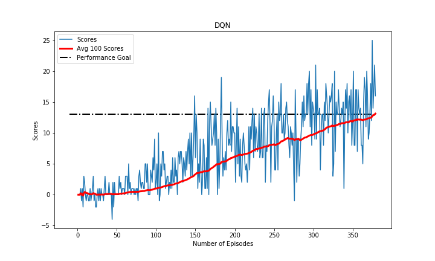
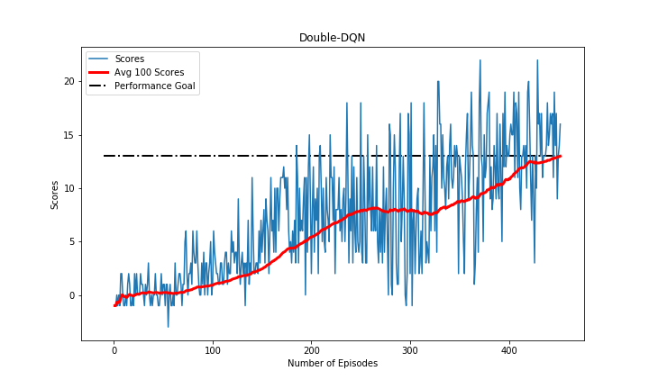

# Udacity DRLND - Navigation

This project entails a submisison for Udacity's Deep Reinforcement Learning Nanodegree Program: Project 1 - Navigation.


The project aims to train an agent in navigating a large square world, collecting yellow bananas and avoiding purple bananas.

### Table of Contents 

1. [Project Description](#description)
2. [Requirements](#requirements)
3. [Training](#training)
4. [Files](#files)
5. [Project Results](#results)
6. [Licensing and Acknowledgements](#licensing)

### Project Description<a name="description"></a>

This project entails training an agent to navigate and collect bananas in a large square world. The agent is given rewards as follows:

- +1 for collecting yellow bananas
- -1 for collecting purple bananas

The agent is expected to obtain as many rewards as possible.  

The state space has 37 dimensions which contain the agent's velocity and ray-based perceptions of objects surrounding the agent's forward direction.

The agent can navigate through the world using the following four discrete actions:

- 0 - move forward
- 1 - move backward
- 2 - turn left
- 3 - turn right

The agent is considered to solve the environment once it attains an **average score of at least 13.0 over the past 100 consecutive episodes**.

### Requirements<a name="requirements"></a>

There are several requirements in order to run this project. 

- Configure Python3.6 and PyTorch environment as described in the [Udacity repository](https://github.com/udacity/deep-reinforcement-learning#dependencies).
- Install the Unity environment following the requirement [steps](https://github.com/udacity/deep-reinforcement-learning/blob/master/p1_navigation/README.md).
- Download the environment from one of the links below.  You need only select the environment that matches your operating system:
    - Linux: [click here](https://s3-us-west-1.amazonaws.com/udacity-drlnd/P1/Banana/Banana_Linux.zip)
    - Mac OSX: [click here](https://s3-us-west-1.amazonaws.com/udacity-drlnd/P1/Banana/Banana.app.zip)
    - Windows (32-bit): [click here](https://s3-us-west-1.amazonaws.com/udacity-drlnd/P1/Banana/Banana_Windows_x86.zip)
    - Windows (64-bit): [click here](https://s3-us-west-1.amazonaws.com/udacity-drlnd/P1/Banana/Banana_Windows_x86_64.zip)
    
    (_For Windows users_) Check out [this link](https://support.microsoft.com/en-us/help/827218/how-to-determine-whether-a-computer-is-running-a-32-bit-version-or-64) if you need help with determining if your computer is running a 32-bit version or 64-bit version of the Windows operating system.

    (_For AWS_) If you'd like to train the agent on AWS (and have not [enabled a virtual screen](https://github.com/Unity-Technologies/ml-agents/blob/master/docs/Training-on-Amazon-Web-Service.md)), then please use [this link](https://s3-us-west-1.amazonaws.com/udacity-drlnd/P1/Banana/Banana_Linux_NoVis.zip) to obtain the environment.
- Place the environment in the preferred path.

### Training<a name="training"></a>

The notebook Navigation.ipynb can be executed to train an agent. In training the agent, a value based method is used. This method is called [Deep-Q-Networks](https://deepmind.com/research/publications/human-level-control-through-deep-reinforcement-learning). Depp-Q-Networks or DQN is essentially a Q-learning which exploits neural networks in the process of updating the policy. In addition, the use of replay buffer is also implemented, where the agent can learn from random sample experiences to make not overlook past good actions which did not occur at the right moment.  

The first training session, the agent uses DQN. This acts as a Q-learning which estimates the best Q value using neural networks. As for the second one, Double-DQN is used in order to address the tendency of DQN of being overoptimistic in values. 

**Execute Navigation.ipynb to train the agent using both DQN and DDQN.**

### Files<a name="files"></a>

```
- Navigation.ipynb # main notebook containing the training process and watching smart agent
- README.md
- Report.pdf # report for the project, includes detailed parameters and results/discussions

- dqnbanana
|- __init__.py 
|- agent.py # agent class
|- model.py # Qnetwork class

- figures
|- banana.png # environment
|- scores_episodes_ddqn.png # ddqn scores
|- scores_episodes_dqn.png # dqn scores

- saved_model
|- DDQN.pth # model's weight for DDQN
|- DQN.pth # model's weight for DQN

```

### Project Results<a name="results"></a>

Based on the agent trained using the chosen hyperparameters and random seed number, the regular DQN performs better than its variant, DDQN. The consistency of both methods is promising, yet the DQN has shown its learning capabilities to be more consistent. The following graphs show these differences. 





It is noted, however, since both methods can solve the environment in relatively low number of episodes, both solutions can be considered as appropriate. In fact, the DDQN can probably be improved further through redesigning the deep neural networks architecture or tuning the hyperparameters (the hyperparameters were tuned only for the DQN, since these sets of parameters already provide a sufficient result). 

### Licensing and Acknowledgements<a name="licensing"></a>

Credits to Udacity [DRLND](https://www.udacity.com/course/deep-reinforcement-learning-nanodegree--nd893) for the introduction to DQN using LunarLander of OpenAI gym as introduction to this course as well as the resources available for PyTorch for first time user. The environment is supported by [Unity mlagents](https://github.com/Unity-Technologies/ml-agents).
